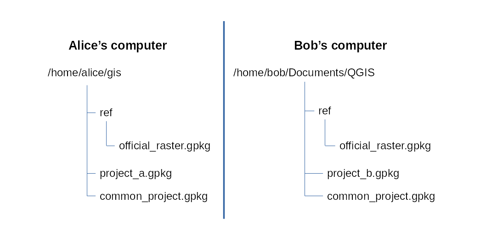

===================
Administrator Guide
===================

This administrator guide will demonstrate how to prepare a project to be used
with the Guided Offline Editing QGIS plugin. It will focus on the prior steps,
before the plugin can be used. It will guide you through the preparation
process, from modifying a PostgreSQL database so that it can be used with the
plugin, to creating a to-be-offline-edited project.

Example context: collecting data about wetlands
===============================================

Imagine that you, Alice (or Alexander if you're a man, but we will use Alice
from now on), work for a biodiversity NGO named We Love Biodiv.

Inside We Love Biodiv, you are the Database Administrator and also the one who
knows QGIS best. Your colleague, Bob, knows nothing about databases, SQL, and
only uses QGIS to make beautiful maps and for data analysis. He doesn't
understand the DB Manager dialog, he can't figure out where to look for
PostgreSQL layers, and he thinks that creating relationships between layers in
QGIS is too complicated, same thing for creating forms (sounds familiar to
you?).

Now, We Love Biodiv is involved in a project whose goal is to collect data
about wetlands on a specific territory. For this project, you and bob will
survey wetlands on the field, then upload collected data into PostreSQL. You
are in charge of designing and creating tables and views in database, then you
have to set up forms in QGIS so that Bob can use them to enter field data.

PostgreSQL prerequisites
========================

Let's assume you have a PostgreSQL service on host ``db.priv.welovbiodiv.org``
that listens on TCP port ``5432``. On that cluster, you have a database named
``wlbdb``. You will use that database to store and protect collected wetland
data.

Schemas and tables
------------------

Inside the ``wlbdb`` database you have at least two PostgreSQL schemas named
``ref`` and ``wetland``. The ``ref`` schema contains tables with reference
data. For example, there is a ``taxon`` table containing names of all species
known to be present in your country, and a ``city`` table that hold all cities
information with their perimeters.

The ``wetland`` schema will hold collected data about wetlands. Inside that
schema you will create tables and design a *data model as normal as possible*.
For the sake of simplicity, we will assume there are only two tables: the main
``wetland`` table with a ``geometry`` column, and a ``wetland_type`` table
containing the set of all wetland types. Of course, the ``wetland`` table will
have a ``type_id`` column which is foreign key referencing the ``wetlandt_ype``
table. On the taxon side, since multiple species will be observed on a given
wetland, and conversely a species will appear on multiple wetlands, we use an
association table named ``wetland_taxon`` (:numref:`db_model`).

.. _db_model:

   Database model

.. note::

        Each table that will be edited in QGIS **must have an integer primary
        key**, even if a natural key already exists (for that column use a
        *unique* constraint and index): this is what the QGIS built-in Offline
        Editing plugin expects so that it can match offline and remote features
        (when a feature is updated or deleted for example).

You may ask: what about the city table? Well, there are multiple choices. You
can add a ``city_id`` column in the ``wetland`` table and ask users to select
the right city. Or you may populate automatically this column using Postgis
intersection functions. Or you may not put this information inside the
``wetland`` table and create a view which join the ``city`` table on
intersection. This is database design issue, not the topic here, so we won't
discuss it further.

We also recommend to **create a** ``qgis`` **schema** and to save QGIS projects
inside that schema.

.. note::

        You do not need to create any table inside the ``qgis`` schema. The
        first time you save a QGIS project to PostgreSQL and select the
        ``qgis`` schema as destination, QGIS will automatically create a
        ``qgis_projects`` table and use it to save and load projects.

Use PostgreSQL power for consistent data
----------------------------------------

A few words about table design.

Please put as much energy as you can to ensure complete and consistent data.
And first, try to reach the highest normal form possible. See
https://en.wikipedia.org/wiki/Database_normalization for more information about
database normalization.

Next, PostgreSQL is not a spreadsheet. It is a feature complete, professional
grade, database management system, with many bells and whistles. Creating a
table with just the columns and their types is nothing but throwing your data
away. Instead you can use all the constraints, views, materialized views, and
triggers machinery to make sure that missing values are computed (or else the
row is rejected) and that columns are consistent (if one is empty, another must
be provided) for instance.

In other words, *make your projects SQL-first and data driven*.

A few examples:

- when you add a ``name`` or a ``title`` column with a not null constraint, you
  should also check that the string cannot be empty (with a :code:`check (title
  <> '')` constraint). Otherwise, you will get surprises when importing CSV
  files,

- check that only valid geometries are saved (with a :code:`check
  (st_isvalid(geometry))` constraint),

- make sure columns are consistent. If, for instance, ``col_a`` and ``col_b``
  are mutually exclusive, meaning either the first or the second must be
  filled, but not both at the same time, and not both can be ``null``, you can
  write something like this: :code:`check ((col_a is not null and col_b is
  null) or (col_a is null and col_b is not null))`. Or if you have
  ``count_min`` and ``count_max`` columns, you can add a :code:`check count_min
  <= count_max` constraint,

- imagine you have a table with ``Point`` geometries, and you want to know in
  which city lies each point. You have multiple options to handle this. First,
  you can have a ``city_id`` column in the table, which is a foreign key to the
  ``ref.city`` table. Then a trigger will compute ``city_id`` for each inserted
  or updated row, using Postgis ``st_intersects`` function. Or, and this is a
  better approach in my opinion, you can create a materialized view that also
  uses ``st_intersects``, without the ``city_id`` column in the main table,
  which is more normal,

- on tables that are not to be loaded within QGIS (more on this below), use all
  PostgreSQL data types. For example, use an ``int4range`` type column instead
  of two ``integer`` columns for minimum and maximum. The range type will
  automatically ensure that minimum is less than maximum and also provides
  operators to test whether a value is within a range. See
  https://www.postgresql.org/docs/current/rangetypes.html. Another example:
  when you have a hierarchy of rows, do not use the classical two columns
  solution, ``id`` and ``parent_id``. Instead use the ``ltree`` data type on a
  single column which is more powerful. See
  https://www.postgresql.org/docs/current/ltree.html,

- add comments on schemas, tables and columns. Especially on columns: QGIS will
  use these comments to provide help for each field when generating forms.

But be aware that there are also some limitations on the database side.
Regarding the Postgis extension as an example, you cannot add an exclusion
constraint on a table with ``Polygon`` geometries to say that polygons must not
overlap. This is because there is no *operator* in Postgis doing the same thing
than the :code:`st_overlaps` function. Of course you can *work around* this
limitation, for instance by creating your own operator (using :code:`create
operator`) but this is not native. Moreover, you cannot easily add a constraint
to prevent *holes* between polygons. In summary, if you want a table where
polygons *partition* an area (that is, no holes and no overlaps) this is not
easily done in Postgis. This is better handled in QGIS. Since QGIS 3, each
layer can prevent saving if there are invalid geometries, or if there are
topological issues (:numref:`qgis_geometry_topology_checks`).

.. _qgis_geometry_topology_checks:

.. figure:: ./_static/img/qgis_geometry_topology_checks.png
   :width: 400px
   :align: center
   :alt: Geometry and topology check in layer properties

   Geometry and topology check in layer properties

On the other hand, with QGIS you will have limitations on the way you use
Postgis. Since some tables will be loaded as layers within QGIS, on these
tables:

- you cannot use some PostgreSQL types, such as ``int4range`` or ``ltree``.
  QGIS will simply ignore these columns. You won't see them in attribute table
  or in generated forms,

- if you want to edit them offline, then the primary key must be an integer,
  even if you have already another natural key,

- generated identity columns (with ``generated by default as identity``) are
  also not supported, so you must use ``serial`` type for now.

.. note::

        Changelog for QGIS 3.8 asserts that identity columns are supported:
        https://qgis.org/en/site/forusers/visualchangelog38/index.html#feature-postgres-provider-add-support-for-generated-identity-columns
        . But without further explainations. To my knownledge, after a little
        testing, this is not the case. Identity primary keys in generated forms
        are not handled as well as serial columns.

Permissions
-----------

Now, let's discuss PostgreSQL roles and permissions.

.. note::

        Since you'll be modifying data directly inside PostgreSQL, we recommend
        to have one PostgreSQL user for each real person that will edit data.
        Avoid common accounts. This is also for tracability reasons.

Say you have two PostgreSQL users named ``alice`` and ``bob``. These users
needs to query data in the ``ref`` schema (but they must not modify it since
this is reference data) and edit data in the ``wetland`` schema.

So you need to grant, to both ``alice`` and ``bob``:

* ``usage`` permission on both schemas ``ref`` and ``wetland``,

* ``select`` permission on all tables in ``ref`` schema,

* ``usage`` permission on all sequences in schema ``wetland``,

* ``select, insert, update, delete`` permissions on all tables in ``wetland``
  schema.

But instead of granting these permissions directly to ``alice`` and ``bob``, we
recommend to create a dedicated role, named ``gis`` for example, grant the
permissions to ``gis``, and assign ``alice`` and ``bob`` to the ``gis`` role.
See https://www.postgresql.org/docs/current/role-membership.html for more
information about role membership. In this manner, if a new user must have the
same permissions, you just need to assign the new user to the ``gis`` role.

In a PostgreSQL console, this would looks like the following.

.. code-block:: psql

   create role gis nologin noinherit;
   grant usage on schema ref to gis;
   grant usage on schema wetland to gis;
   grant usage on all sequences in schema wetland to gis;
   grant select on all tables in schema ref to gis;
   grant select, insert, update, delete on all tables in schema wetland to gis;
   grant alice to gis;
   grant bob to gis;

.. note::

       One final word about users. Even if you, Alice, are the Database
       Administrator, we recommend not to grant all permissions to ``alice``
       user. Instead, *you should log in as a dedicated user for administration
       tasks*, for example named ``dbadmin``. ``alice`` is the user you should
       impersonate when you wear your QGIS User hat. When you wear your
       Database Administrator hat, for example when granting permissions like
       above, you should use ``dbadmin``.

If you follow the previous advice, then the ``qgis.qgis_projects`` table where
QGIS will save projects should be only edited by this ``dbamin`` user. Alice
and Bob should be only able to read projects but not to modify them.

.. code-block:: psql

   grant usage on schema qgis to gis;
   grand usage on schema qgis to dbadmin;
   grant usage on all sequences in schema qgis to dbadmin;
   grant select on all tables in schema qgis to gis;
   grant select, insert, update, delete on all tables in schema qgis to dbadmin;

QGIS prerequisites
==================

Now that your ``wlbdb`` PostgreSQL database is all set, rock solid with lots of
constraints, and ready to receive field data about wetlands, let's talk about
QGIS environment.

Common configuration ID in authentication database
--------------------------------------------------

How both Alice and Bob will open the same QGIS project and connect to
PostgreSQL using their own distinct credentials? The trick is to *use a common
configuration ID in QGIS authentication database*.

The configuration ID is a string of *exactly* seven characters that refers to
some credentials used by QGIS. Whenever you save new credentials
(username/password, private key, ...) within QGIS (for example to connect to a
WFS server or to a PostgreSQL database), QGIS creates a new configuration in
its authentication database. And each configuration is identified
programmatically by this 7-chars ID. Usually, this ID is randomly generated by
QGIS. When you need some credentials to connect to something, QGIS uses this ID
to refer to the credentials, and save this ID inside the project so that no
password is stored in clear text in the project. See
https://docs.qgis.org/3.4/en/docs/user_manual/auth_system/auth_overview.html#authentication-database
for more information.

A QGIS authentication database (authdb for short) is private to a user. So for
a QGIS project to work for both Alice and Bob, the project must refers to the
same configuration ID in both Alice authdb and Bob authdb. Thus, the
configuration ID must not be randomly generated, but *must be set to a value
shared across all users*.

Back to our example, let's assume that the shared configuration ID for all We
Love Biodiv users is the string ``wlbauth`` (length: 7). Consequently, Alice
must create a new authentication configuration in QGIS (menu
:menuselection:`Settings --> Options --> Authentication` and click on the
:guilabel:`+` button on the right side), with the following information
(:numref:`qgis_auth_configuration`):

* :guilabel:`name`: a human readable name for this configuration. For example
  :guilabel:`Alice wlbdb credentials`,

* :guilabel:`Id`: click on the lock button to prevent the Id to be randomly
  generated. Then, enter the shared ID ``wlbauth``.

* :guilabel:`Username` and :guilabel:`Password`: Alice's credentials to connect
  to ``wlbdb`` PostgreSQL database.

.. _qgis_auth_configuration:

   Alice's authentication configuration in QGIS using ``wlbauth`` ID

Of course Bob must do the same on his side. He opens QGIS on his computer then
creates a new authentication configuration using the same ``wlbauth`` ID.
Everything else is specific to Bob:

* :guilabel:`name`: :guilabel:`Bob wlbdb credentials`,

* :guilabel:`Id`: ``wlbauth``,

* :guilabel:`Username` and :guilabel:`Password`: Bob's credentials to connect to
  ``wlbdb`` PostgreSQL database.

A common folder hierarchy and a variable
----------------------------------------

A QGIS project may contains at the same time:

* PostgreSQL layers to edit and,

* local filesystem layers (for example rasters for your country or state).

When such a project needs to be shared across multiple computers and multiple
users, it is challenging to have a problem-free case, and often users will see
the ":guilabel:`Layer not found`" dialog and are asked to provide another path
for each layer.

To address this situation, we need precision and strictness. First, a **common
folder tree** is needed.

*Each user must choose a specific folder* where this common tree will land. For
example it might be ``/home/alice/gis`` for Alice and
``/home/bob/Documents/QGIS`` for Bob (yes, they both use Linux, like everyone
in the World, isn't it?).

Under this folder, common layers must share the same path. For example, the
official raster for your country, saved as ``official_raster.gpkg`` (yes,
rasters are saved in GeoPackage, but this is the case everywhere, isn't it?),
must be present on both Alice and Bob's computers in the same ``ref`` subfolder
(yes, for reference data, as usual) (:numref:`common_folder_tree`).

.. _common_folder_tree:

   Common folder tree for common layers

Each project should be saved at the top level of this tree, so that relative
paths do not contains parent folders. In other words, projects should be at the
top level while layers can be in subfolders.

But other problems arise when saving a project in PostgreSQL: we cannot save
paths as relative. Sounds sensible: what is the relative path to a PostgreSQL
table? Furthermore, we cannot set the :guilabel:`Project home` property in the
:guilabel:`Project properties` dialog, because in one case it would be
``/home/alice/gis`` and in the other case it would be
``/home/bob/Documents/QGIS``.

To work around this issue, the plugin asks each user to **set a global QGIS
variable**, named :guilabel:`gis_data_home`, whose value is *the absolute path
to the top-level folder of the common hierarchy*, namely ``/home/alice/gis``
for Alice and ``/home/bob/Documents/QGIS`` for Bob. To do so, go to
:menuselection:`Settings --> Options` and switch to the :guilabel:`Variables`
tab. Click on the :guilabel:`+` button to add a variable and name it
``gis_data_home``. Give it the correct value, the correct path and validate
(:numref:`gis_data_home_variable`).

.. _gis_data_home_variable:

   gis_data_home global QGIS variable

Thanks to this variable, when the plugins converts a project for offline
edition, it first saves the project in the :guilabel:`gis_data_home` folder and
convert all paths to relative. In this way, all local layers are found *under*
the project, and their relative paths will begin with `./`, so this will work
on all computers, provided that the folder tree are the same.

Plugin configuration
--------------------

The next step is to configure the Guided Offline Editing plugin so that it can
connect to PostgreSQL and find all projects that have been prepared for offline
edition.

For that, each user can edit the ``QGIS3.ini`` file in the ``QGIS`` folder
under its profile folder. To find your profile folder, in QGIS, go to
:menuselection:`Settings --> User Profiles --> Open Active Profile Folder`.
Then, in the file manager window, navigate to the ``QGIS`` folder, and edit the
``QGIS3.ini`` file.

In ``QGIS3.ini``, you need to add a section ``[Plugin-GuidedOfflineEditing]``.
Then, inside this section you can configure multiple databases. Each database
will have its own submenu entry under the :menuselection:`Guided Editing` menu.
To declare a database, you must prepend the ``databases\<Database Name>\``
prefix to all its parameters. For example, if you have a database named ``DB
1``, you will prepend the ``databases\DB%201\`` prefix.

.. note::

       ``QGIS3.ini`` is an ASCII-encoded file which does not tolerate spaces.
       So you must encode each space character with the ``%20`` code. The same
       goes for accented characters. For example, if the database name contains
       a "é" character (e-acute), you must replace all instances of this
       caracter with it ``%E9`` code.

For each database to be configured, you can provide the following parameters:

* ``host``: hostname of the PostgreSQL server (default: ``localhost``),

* ``port``: TCP post for the PostgreSQL service (default: ``5432``),

* ``authcfg``: configuration ID in QGIS authentication database for PostgreSQL
  credentials,

* ``dbname``: name of the PostgreSQL database to connect to,

* ``schema``: name of the PostgreSQL schema containing the ``qgis_projects``
  table (default: ``qgis``),

* ``sslmode``: does PostgreSQL connection need SSL? (allowed values:
  ``enabled`` or ``disabled``, default: ``disabled``).

In our We Love Biodiv example, there is only one database named *We Love Biodiv
DB*. Thus Alice and Bob should add the following lines to their respective
``QGIS3.ini`` file.

.. code-block:: ini

   [Plugin-GuidedOfflineEditing]
   databases\We%20Love%20Biodiv%20DB\authcfg=wlbauth
   databases\We%20Love%20Biodiv%20DB\dbname=wlbdb
   databases\We%20Love%20Biodiv%20DB\host=db.priv.welovbiodiv.org
   databases\We%20Love%20Biodiv%20DB\schema=qgis

Going further: deploying configuration in the organization
----------------------------------------------------------

As you can see, thanks to the common ``wlbauth`` value for the ``authcfg``
parameter, both Alice and Bob have the same plugin configuration, although
their usernames and passwords for connecting to PostgreSQL are different. Even
if a new user Charlie is involved in the wetland project, as long as he saves
his PostgreSQL credentials under the ``wlbauth`` ID, he will have exactly the
same configuration.

So, instead of each user modifying its ``QGIS3.ini`` file, you can deploy the
common configuration on all workstations within We Love Biodiv using the
``QGIS_GLOBAL_SETTINGS_FILE`` environment variable if you already do so.

See
https://docs.qgis.org/testing/en/docs/user_manual/introduction/qgis_configuration.html?highlight=organization#deploying-qgis-within-an-organization
for more information about deploying common QGIS configuration inside an
organization.

Preparing the project
=====================

Finally, you, Alice, can get your hands dirty in QGIS, preparing a project for
offline edition. So Let's get started.

We recommend not to use your :guilabel:`default` QGIS profile when preparing a
project. Much like we advise you to have two PostgreSQL users, ``alice`` and
``dbadmin``, we think that you should have two QGIS profiles. Your
:guilabel:`default` profile should be used when you are working as a normal
QGIS user, that is when you want to insert, update or delete data in tables.
But when you want to modify the project, when you want to create relations
between layers or when you want to update forms, you should use another
profile, say :guilabel:`gisadmin``.

Creating Postgis connections
----------------------------

With your :guilabel:`gisadmin` profile opened, create two Postgis connections,
if they do not already exist: one using the ``wlbauth`` configuration ID for
credentials (``alice`` PostgreSQL user) and one for the ``dbadmin`` PostgreSQL
user. Open the :guilabel:`Data Source Manager` and the :guilabel:`PostgreSQL`
tab. Click the :guilabel:`New` button and fill the form
(:numref:`qgis_new_postgis_connection`):

* :guilabel:`Name`: ``We Love Biodiv DB (alice)`` for one connection and ``We
  Love Biodiv DB (dbadmin)`` for the second one,

* :guilabel:`Host`: ``db.priv.awelovbiodiv.org``,

* :guilabel:`Post`: ``5432``,

* :guilabel:`Database`: ``wlbdb``,

* :guilabel:`Authentication`: under the configuration tab, choose
  :guilabel:`Alice wlbdb credentials` for one connection and :guilabel:`dbadmin
  wlbdb credentials` for the other.

You can then :guilabel:`Test Connection` using the button, and you should see a
success message.

Don't forget to check ":guilabel:`Also list tables with no geometry`" and
":guilabel:`Allow saving/loading QGIS projects in the database`".

.. _qgis_new_postgis_connection:

   New Postgis connection dialog

Project properties
------------------

You can now create a new empty QGIS Project. And before loading any layer you
should set some properties and **save project to PostgreSQL**.

Go to :menuselection:`Project --> Properties`
(:numref:`qgis_project_properties_general`). On the :guilabel:`General` tab:

* set the project :guilabel:`Title` using a human-readable and user-friendly
  string (eg. "Data collection about wetlands").

* we recommend to :guilabel:`Save paths` as :guilabel:`Relative`. This is not
  mandatory for now but will be in future versions of the plugin where one can
  mix PostgreSQL layers and local layers.

.. _qgis_project_properties_general:

   Project properties dialog

On the :guilabel:`Metadata` tab, you can (and should) fill some metadata about
the project. On the :guilabel:`SCR` tab, you can chosse the default SCR for the
project. You can also set default styles if you want.

Then you must save the project to PostgreSQL. Go to :menuselection:`Project -->
Save To --> PostgreSQL`. Select the correct database (in our example:
:guilabel:`We Love Biodiv DB (dbadmin)`), the ``qgis`` schema, and give the
project a *PostgreSQL valid name*, that is no space, no accent, no uppercase
letters, no dash (``-``), only lowercase letters, digits, and underscore
(``_``). For example, give it the name ``wetland_collect``.

.. note::

       PostgreSQL allow any character in its identifiers but requires to
       surround them with double-quotes (``"``) if they do not obey the previous
       rule (eg. ``"Wetland_data"`` because of the uppercase ``W``).

.. note::

       Don't forget to save your project on a regular basis, namely after each
       modification.

Load layers
-----------

Using either the built-in :guilabel:`DB Manager` plugin or the :guilabel:`Data
Source Manager`, add all needed layers to your project, but this time using the
:guilabel:`We Love Biodiv (alice)` connection (``wlbauth`` configuration ID, so
that Bob can also load the layers when he opens the project):

* the ``ref.taxon`` table,

* the ``wetland.wetland_type`` table,

* the ``wetland.wetland_taxon`` table,

* the ``wetland.wetland`` table.

You can also load the local raster ``official_raster.gpkg`` in the ``ref``
folder.

You can organize layers as you like. We suggest to create at least two groups
inside QGIS legend:

* a group entitled "**Editable layers**" where, as the name indicates, you put the
  two editable layers ``wetland.wetland`` and ``wetland.wetland_taxon``.

* a group entitled "**Helper layers**" where you put other layers.

Again, you can do as yo like. But having the group "Editable layers" makes it
clear for users what layers can be edited.

Other recommendations:

* give a human readable and user-friendly name to each layer. Don't stick with
  the computer name ``wetland_taxon`` for example and rename it ``Association
  between wetlands and taxons``,

* in the project properties, you can make some layers *mandatory* or
  *read-only*. Go to :menuselection:`Project --> Properties` and switch to the
  :guilabel:`Data Sources` tab. There you can check for each layer either the
  :guilabel:`Read-Only` checkbox or the :guilabel:`Required` checkbox
  (:numref:`qgis_project_properties_data_sources`).

.. _qgis_project_properties_data_sources:

   Declare in QGIS read-only and mandatory layers

Create relationships between layers
-----------------------------------

Still in :guilabel:`Project Properties`, switch to the :guilabel:`Relations`
tab, and create a relation for each foreign key in PostgreSQL. QGIS can create
relations automatically if you click the :guilabel:`Discover Relations` button.
It will try to discover foreign keys between loaded layers.  But make sure to
check each of them and to add relations that QGIS missed
(:numref:`qgis_project_properties_relations`).

.. _qgis_project_properties_relations:

   Declare in QGIS relations between layers

Improve forms
-------------

Now, you have to improve QGIS auto-generated forms as much as you can.

For a given layer, QGIS has already done useful things. For example, it has
chosen sensible widgets depending on column types (range widget for integer
columns, calendar widget for date columns, and so on), and it has put a
required constraint whenever a column has a not null constraint.

QGIS has also taken into account PostgreSQL comments for each column to add a
help message that will be shown when the mouse cursor is hovered above a field
without clicking. That's why it is important to create comments on columns into
PostgreSQL.

But you can do better. First, you should give a human-readable and user
friendly alias for each field. Otherwise, QGIS will use the column name.

Second, you should replicate PostgreSQL constraint whenever possible. For
example, if you have an integer column ``count`` with a constraint ``check
(count >= 0)``, QGIS will not catch this constraint in the form, and allow
negative values by default. You should then enforce that the minimum value is 0
in the form.

Of course, you will not be able to copy every PostgreSQL constraint like this.
For example if you have a mutually exclusive constraint for two columns
``col_a`` and ``col_b`` (meaning that if ``col_a`` is not ``null`` then
``col_b`` must be ``null``, and conversely, and both columns cannot be ``null``
at the same time), it is not possible to enforce this constraint in QGIS form.
In such cases, the best you can do is to explain the constraint in PostgreSQL
comments.

.. code-block:: psql

   comment on column table.col_a is 'Represents something. If this field is not empty, then col_b must be left empty.'
   comment on column table.col_b is 'Represents other thing. If this field is not empty, then col_a must be left empty.'

To improve a form for a layer, go to the layer :guilabel:`Properties`
(double-click on the layer in the legend, or right-click the layer and select
:guilabel:`Properties`) and open the :guilabel:`Attributes Form` tab
(:numref:`qgis_layer_properties_form`).

You should spent as much time as you can to make the best forms possible for
your users.

.. _qgis_layer_properties_form:

   Configure attributes form for a layer

Set variables for the plugin
----------------------------

The last step is to indicate to the plugin what layers should be downloaded
offline. You may not want to download all layer from a project. For example,
you may have basemap layer in WMS, and such a layer should not be downloaded
for offline edition.

This is simply a matter of setting a variable in each layer to be downloaded.
Go to the layer :guilabel:`Properties` (double-click on the layer in the
legend, or right-click the layer and select :guilabel:`Properties`) and switch
to the :guilabel:`Variables` tab.

Click on the :guilabel:`+` button at the bottom of the dialog to add a variable:

* name it **offline**,

* give it value **enabled** (or **true**, or **yes**).

Do this for each relevant layer, and that's it! Now the Guided Offline Editing
plugin will recognize this layer as a to-be-offline-edited layer.

.. _qgis_layer_properties_offline_variable:

   Add offline variable on a layer

Done !
======

Guess what, Alice? You're done! After all these efforts, from now on, when Bob
installs the Guided Offline Editing plugin and launches it, the plugin will
automatically find the :guilabel:`wetland_collect` project and show it in the
available projects to download. Bob just needs to select the project and click
the :guilabel:`Download` button and he will benefits from all your hard work
while creating custom forms.

.. |~| unicode:: 0xA0
   :trim:
